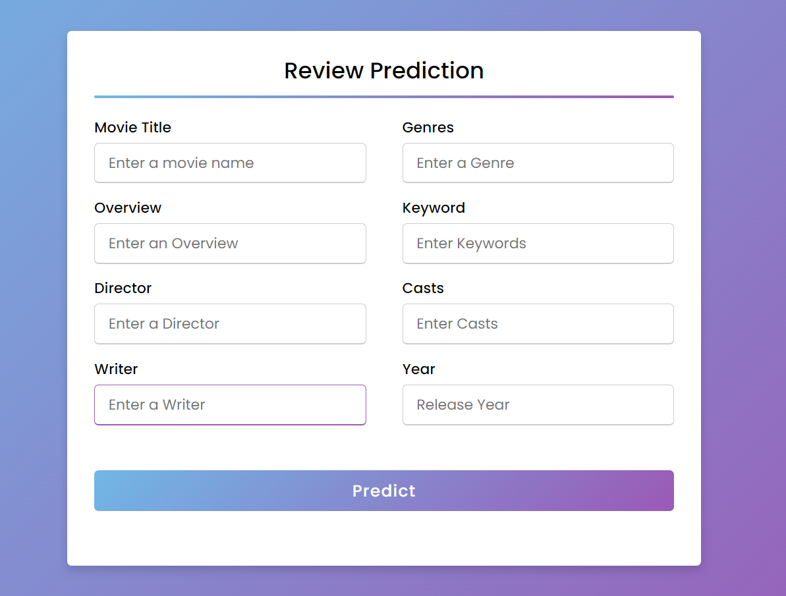

# movie-score-prediction

## This is a project to demonstrate a model made for predicting movie scores based on movie features

run on terminal to install requirements
- pip install -r requirements.txt

- run app.py 
the app will run on localhost:3000

here are the features that the model will collect to predict

Thanks for checking out my project!